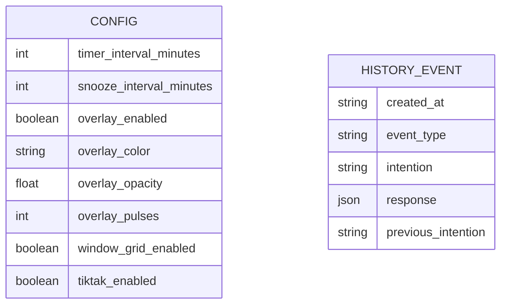

# Data Model — Sino de Atencao

> Documento vivo do modelo de dados. Atualizado sempre que um dado persistido for criado, alterado ou removido.
> **Ultima atualizacao:** 2026-05-23

---

## Indice

- [Visao Geral](#visao-geral)
- [Diagrama ER](#diagrama-er)
- [Entidades](#entidades)
- [Enums e Dominio de Valores](#enums-e-dominio-de-valores)
- [Indices e Performance](#indices-e-performance)
- [Classificacao de Privacidade](#classificacao-de-privacidade)
- [Decisoes de Modelagem](#decisoes-de-modelagem)

---

## Visao Geral

O app usa dois arquivos locais como persistencia: `config.json` para preferencias gerais e `history.jsonl` para eventos de progresso/reflexao. Nao ha banco de dados, ORM, servidor remoto ou sincronizacao.

**Banco de dados:** arquivos locais JSON e JSON Lines
**ORM / acesso:** biblioteca padrao Python `json` e `pathlib`
**Extensoes relevantes:** nenhuma

---

## Diagrama ER

Nao ha relacionamento entre arquivos. `history.jsonl` e uma sequencia append-only de eventos locais.

---

## Entidades

---

### Config

> Preferencias locais que controlam intervalos e comportamento visual do alerta.

**Arquivo:** `config.json`
**Servico responsavel:** funcoes `load_config`, `save_config` e `normalize` em `main.py`

| Campo | Tipo | Nullable | Default | Descricao |
|-------|------|----------|---------|-----------|
| `timer_interval_minutes` | inteiro | Nao | `15` | Intervalo principal entre alertas, em minutos inteiros |
| `snooze_interval_minutes` | inteiro | Nao | `5` | Intervalo usado pelo botao `Adiar`, em minutos inteiros |
| `overlay_enabled` | booleano | Nao | `true` | Define se o overlay visual aparece antes do modal |
| `overlay_color` | string | Nao | `#FF0000` | Cor do overlay fullscreen |
| `overlay_opacity` | float | Nao | `0.15` | Opacidade maxima do overlay, limitada entre `0.01` e `0.35` |
| `overlay_pulses` | inteiro | Nao | `3` | Quantidade de pulsacoes suaves do overlay |
| `window_grid_enabled` | booleano | Nao | `true` | Habilita tentativa de organizar Chrome e terminal ao iniciar sessao |
| `tiktak_enabled` | booleano | Nao | `true` | Habilita o tiktak curto reproduzido ao iniciar uma sessao |

**Constraints:**
- `timer_interval_minutes >= 1`
- `snooze_interval_minutes >= 1`
- `overlay_pulses >= 1`
- `0.01 <= overlay_opacity <= 0.35`

**Relacionamentos:** nenhum.

---

### HistoryEvent

> Evento local que registra progresso, reflexoes e mudancas relevantes da sessao.

**Arquivo:** `history.jsonl`
**Servico responsavel:** funcoes `save_history`, `load_history` e metodo `show_history` em `main.py`

| Campo | Tipo | Nullable | Default | Descricao |
|-------|------|----------|---------|-----------|
| `created_at` | string ISO 8601 | Nao | data/hora local atual | Momento em que o evento foi registrado |
| `event_type` | string | Nao | `check_in` quando ausente em registros antigos | Tipo do evento |
| `intention` | string | Nao | nenhum | Intencao ativa no momento do evento |
| `response` | objeto, string legada ou texto de fechamento | Sim | objeto com strings vazias | Respostas escritas no alerta; cada pergunta tem um campo proprio; no encerramento da sessao pode guardar um fechamento textual opcional |
| `previous_intention` | string | Sim | ausente | Intencao anterior em eventos de ajuste |

**Constraints:**
- Um registro ocupa uma linha JSON por evento.
- Linhas invalidas sao ignoradas na leitura.
- `response` pode conter strings vazias para registrar check-ins sem escrita.
- `response` pode conter um texto curto de fechamento ao encerrar a sessao.
- Registros novos usam objeto com `current_mind`, `alignment` e `next_action`.
- Registros antigos podem ter `response` como string simples e continuam legiveis.

**Relacionamentos:** nenhum.

---

## Enums e Dominio de Valores

### HistoryEventType

Usado em: `history.jsonl.event_type`

| Valor | Significado |
|-------|-------------|
| `session_start` | Inicio de uma sessao com a intencao escolhida |
| `check_in` | Alerta periodico fechado pelo usuario |
| `snoozed` | Alerta adiado pelo usuario |
| `intention_adjusted` | Intencao atual alterada |
| `session_ended` | Sessao encerrada |

### CheckInResponse

Usado em: `history.jsonl.response` quando `event_type` e `check_in`

| Campo | Significado |
|-------|-------------|
| `current_mind` | Resposta para "O que esta ocupando sua mente agora?" |
| `alignment` | Resposta para "Isso ajuda ou desvia da intencao?" |
| `next_action` | Resposta para "Qual e a proxima acao minima?" |

---

## Indices e Performance

Nao ha indices. `history.jsonl` e lido inteiro para exibicao do historico.

| Indice | Arquivo | Campos | Tipo | Motivo |
|--------|---------|--------|------|--------|
| Nao aplicavel | `history.jsonl` | Nao aplicavel | Nao aplicavel | Volume esperado e baixo para uso pessoal local |

---

## Classificacao de Privacidade

| Campo | Arquivo | Classificacao | Justificativa |
|-------|---------|---------------|---------------|
| `timer_interval_minutes` | `config.json` | Preferencia local | Nao identifica o usuario |
| `snooze_interval_minutes` | `config.json` | Preferencia local | Nao identifica o usuario |
| `overlay_enabled` | `config.json` | Preferencia local | Pode indicar preferencia visual, mas fica local |
| `overlay_color` | `config.json` | Preferencia local | Nao identifica o usuario |
| `overlay_opacity` | `config.json` | Preferencia local | Pode indicar preferencia visual, mas fica local |
| `overlay_pulses` | `config.json` | Preferencia local | Pode indicar preferencia visual, mas fica local |
| `window_grid_enabled` | `config.json` | Preferencia local | Nao identifica o usuario, mas ativa leitura local da lista de janelas via KWin ou `wmctrl` |
| `tiktak_enabled` | `config.json` | Preferencia local | Nao identifica o usuario; apenas define se o app toca o sinal sonoro de inicio |
| `created_at` | `history.jsonl` | Pessoal contextual | Revela horarios de uso do app |
| `event_type` | `history.jsonl` | Pessoal contextual | Revela padroes de uso da sessao |
| `intention` | `history.jsonl` | Pessoal | Pode conter tarefas, projetos, pensamentos ou informacoes sensiveis digitadas pelo usuario |
| `response.current_mind` | `history.jsonl` | Pessoal ou sensivel | Texto livre pode conter qualquer informacao pessoal ou sensivel |
| `response.alignment` | `history.jsonl` | Pessoal ou sensivel | Texto livre pode conter qualquer informacao pessoal ou sensivel |
| `response.next_action` | `history.jsonl` | Pessoal ou sensivel | Texto livre pode conter qualquer informacao pessoal ou sensivel |
| `response` em `session_ended` | `history.jsonl` | Pessoal ou sensivel | Texto livre opcional de fechamento pode conter qualquer informacao pessoal ou sensivel |
| `previous_intention` | `history.jsonl` | Pessoal | Pode conter tarefas, projetos ou pensamentos anteriores |

**Regras gerais:**
- Nenhum campo deve ser enviado para internet.
- `history.jsonl` deve ser tratado como arquivo pessoal do usuario.
- Funcionalidades futuras de exportacao devem deixar claro que o usuario esta gerando uma copia do historico.
- Funcionalidades futuras de sincronizacao ou analytics nao fazem parte do escopo atual.

---

## Decisoes de Modelagem

### ADR-DM-001 — Configuracao em JSON simples

| Campo | Detalhe |
|-------|---------|
| **Status** | Aceita |
| **Data** | 2026-05-15 |
| **Contexto** | O app precisa permitir ajustes locais sem banco de dados. |
| **Decisao** | Usar `config.json` com chaves simples e defaults no codigo. |
| **Alternativas consideradas** | Variaveis hardcoded; arquivo INI; SQLite. |
| **Consequencias** | Facil de editar manualmente; nao indicado para configuracoes complexas. |

### ADR-DM-002 — Historico em JSON Lines

| Campo | Detalhe |
|-------|---------|
| **Status** | Aceita |
| **Data** | 2026-05-15 |
| **Contexto** | O usuario quer perspectiva de progresso com dados persistidos localmente. |
| **Decisao** | Usar `history.jsonl`, um evento JSON por linha. |
| **Alternativas consideradas** | Nao salvar historico; salvar lista unica em JSON; SQLite. |
| **Consequencias** | Append simples e legivel; visualizacao atual le o arquivo inteiro. |

### ADR-DM-003 — Respostas separadas por pergunta

| Campo | Detalhe |
|-------|---------|
| **Status** | Aceita |
| **Data** | 2026-05-15 |
| **Contexto** | Um campo livre unico permitia responder apenas uma pergunta e deixava o historico ambiguo. |
| **Decisao** | Salvar `response` como objeto com `current_mind`, `alignment` e `next_action`. |
| **Alternativas consideradas** | Manter texto unico; criar tres eventos separados por alerta. |
| **Consequencias** | Historico fica mais estruturado; leitura precisa manter compatibilidade com registros antigos em string. |

### ADR-DM-004 — Preferencia local para grid de janelas

| Campo | Detalhe |
|-------|---------|
| **Status** | Aceita |
| **Data** | 2026-05-15 |
| **Contexto** | O usuario quer testar organizacao automatica de janelas ao iniciar a contagem. |
| **Decisao** | Adicionar `window_grid_enabled` em `config.json`. |
| **Alternativas consideradas** | Sempre organizar janelas sem configuracao; criar arquivo separado de layout. |
| **Consequencias** | Recurso pode ser desligado sem alterar codigo; layout ainda e fixo no MVP. |
