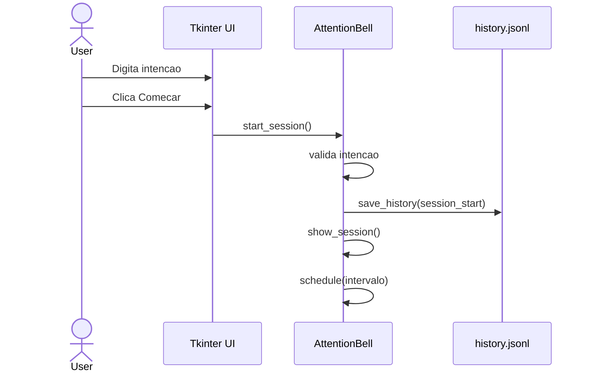
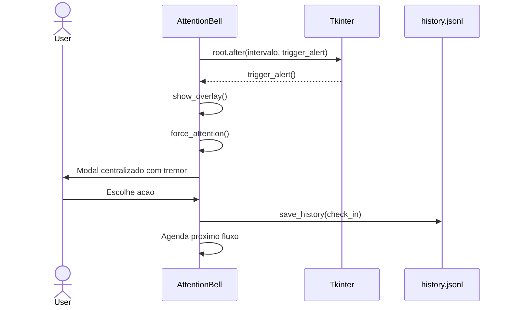
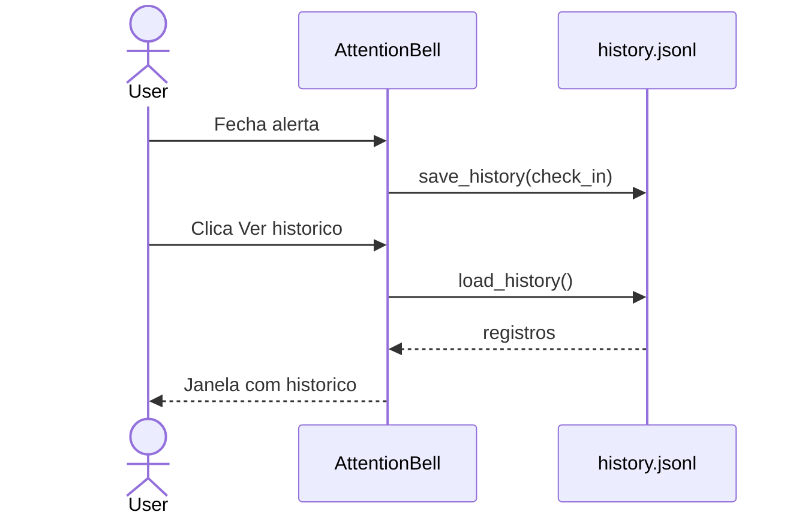
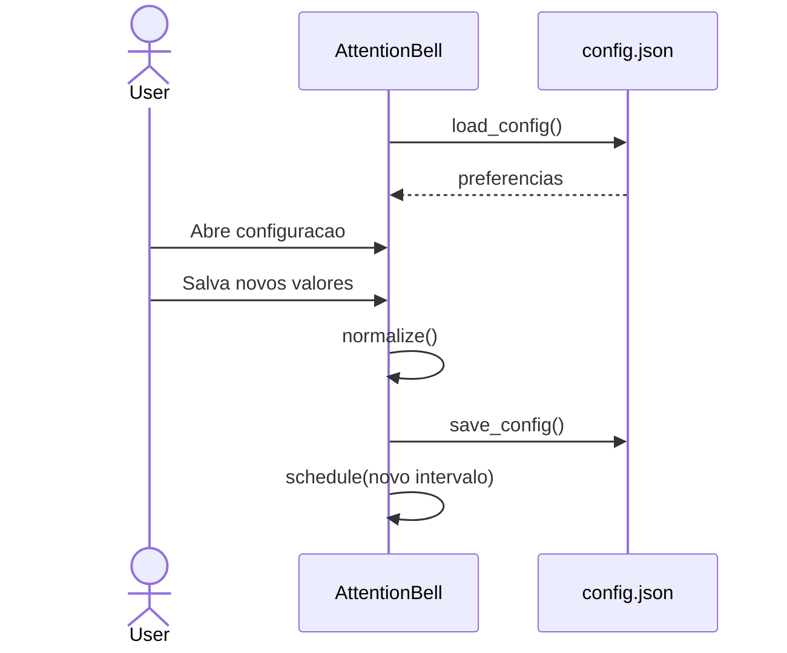
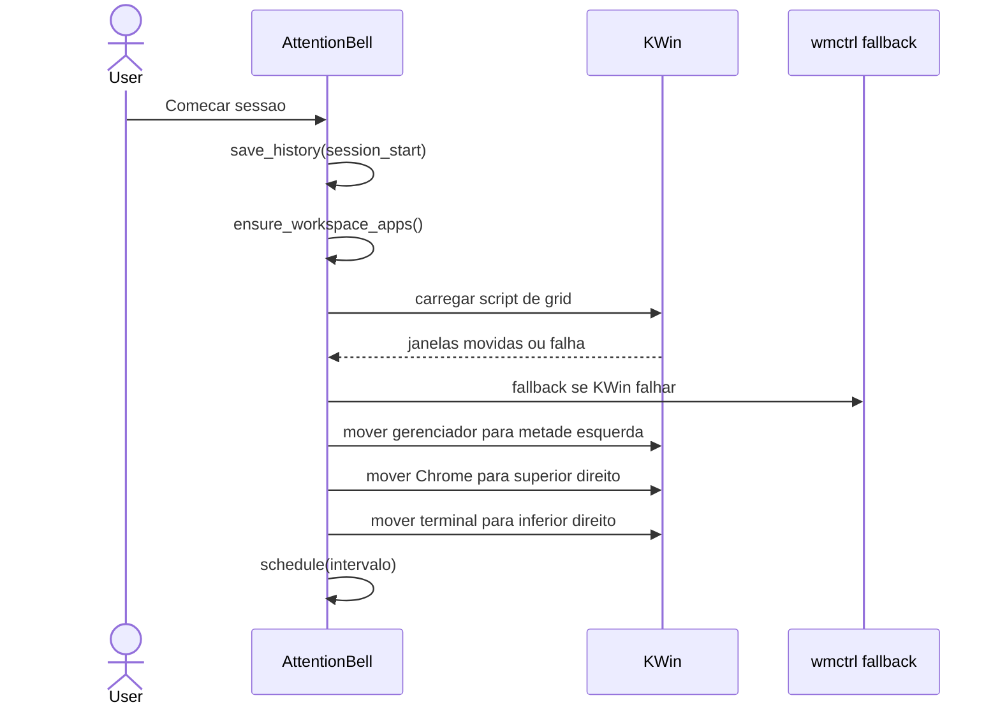
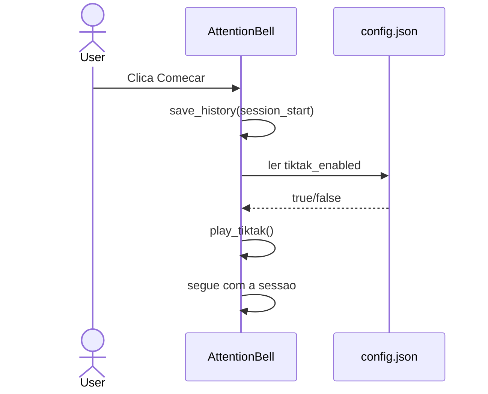
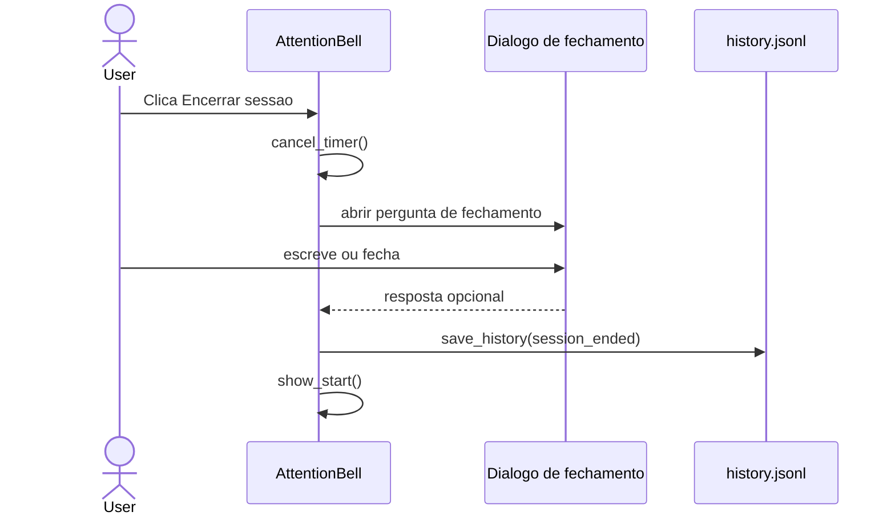

# System Feature Flows

> Registro historico e incremental dos fluxos internos de cada funcionalidade.
> Este documento cresce a cada nova feature implementada e nao deve ter secoes removidas sem registro de decisao.

---

## Indice

- [Visao Geral da Arquitetura](#visao-geral-da-arquitetura)
- [Convencoes deste Documento](#convencoes-deste-documento)
- [Feature: Sessao de Intencao](#feature-sessao-de-intencao)
- [Feature: Timer e Alerta de Atencao](#feature-timer-e-alerta-de-atencao)
- [Feature: Historico Local](#feature-historico-local)
- [Feature: Configuracao Local](#feature-configuracao-local)
- [Feature: Grid Experimental de Janelas](#feature-grid-experimental-de-janelas)
- [Feature: Sinal Sonoro de Inicio da Sessao](#feature-sinal-sonoro-de-inicio-da-sessao)
- [Feature: Encerramento de Sessao](#feature-encerramento-de-sessao)

---

## Visao Geral da Arquitetura

**Padrao arquitetural:** aplicacao desktop monolitica orientada a eventos.

**Fluxo global de interacao:**

```text
Usuario
    -> Tkinter widgets
        -> Metodos de AttentionBell
            -> Estado em memoria
            -> root.after() para timers
            -> Arquivos locais quando ha persistencia
```

**Camadas e responsabilidades:**

| Camada | Responsabilidade |
|--------|------------------|
| Interface Tkinter | Entradas do usuario, janelas, botoes, overlay e modais |
| Orquestracao | Classe `AttentionBell`, estado da sessao e controle de timers |
| Persistencia local | Funcoes `load_config`, `save_config`, `load_history` e `save_history` |
| Sistema operacional | Gerenciador de janelas, bell do sistema e politica de foco |
| Ferramenta local opcional | KWin via D-Bus no KDE Wayland; `wmctrl` como fallback no Linux/X11. Em macOS e Windows, ferramentas de grid nao estao disponiveis |

---

## Convencoes deste Documento

- Nao ha API HTTP, autenticacao, banco de dados ou integracoes externas.
- Persistencia e feita apenas em arquivos locais no diretorio do projeto.
- Timers devem usar `root.after()` para evitar bloqueio da interface.
- Respostas e intencoes podem conter texto pessoal e devem permanecer locais.
- Organizacao de janelas e opcional, local e dependente de suporte do gerenciador de janelas.

---

# Feature: Sessao de Intencao

> **Versao:** 1.0.0
> **Implementada em:** 2026-05-15
> **Status:** Concluida

---

## Resumo

Esta feature cria o ritual inicial do app: antes de qualquer timer, o usuario declara uma intencao curta para a sessao. A intencao fica em memoria enquanto a sessao esta ativa e e usada nos alertas periodicos.

**Motivacao:** Sem uma intencao explicita, o alerta seria generico e menos util.
**Resultado:** O app abre direto na tela de intencao e so inicia o timer depois de uma entrada valida.

---

## Fluxo Principal

### 1. Ponto de Entrada

- **Tipo:** Interface desktop Tkinter
- **Arquivo:** `main.py`
- **Evento:** abertura do app e clique em `Comecar`
- **Autenticacao:** nenhuma

Ao iniciar, `AttentionBell.__init__` cria a janela principal e chama `show_start()`.

### 2. Validacao de Entrada

- **Arquivo:** `main.py`
- **Biblioteca:** Tkinter e validacao manual com `strip()`

| Campo | Tipo | Obrigatorio | Regra de validacao |
|-------|------|-------------|--------------------|
| Intencao | string | Sim | Nao pode ficar vazia apos `strip()` |

**Falha de validacao:** exibe `messagebox.showinfo` e nao inicia sessao.

### 3. Orquestracao da Aplicacao

- **Arquivo:** `main.py`
- **Metodo:** `start_session`

1. Le o texto do campo de intencao.
2. Valida que ha conteudo.
3. Atualiza `current_intention`.
4. Marca a sessao como ativa.
5. Registra `session_start` no historico local.
6. Toca o tiktak inicial se a preferencia estiver ativa.
7. Renderiza a tela de sessao.
8. Agenda o timer principal.

### 4. Regras de Negocio

| Regra | Descricao | Localizacao no Codigo |
|-------|-----------|-----------------------|
| Intencao obrigatoria | O timer nao deve iniciar sem intencao declarada. | `start_session` |
| Intencao atual em memoria | A intencao ativa fica em `current_intention`. | `AttentionBell` |
| Sinal sonoro opcional | O inicio da sessao pode tocar um tiktak curto. | `start_session`, `play_tiktak` |
| Fechar minimiza | O botao `X` minimiza em vez de encerrar o app. | `root.protocol("WM_DELETE_WINDOW", root.iconify)` |

### 5. Persistencia / Integracoes

| Repositorio | Operacao | Arquivo |
|-------------|----------|---------|
| Historico local | Grava evento `session_start` | `history.jsonl` |

**Integracoes externas:** nenhuma.

### 6. Resposta Final

Nao ha resposta HTTP. Em sucesso, a tela muda para `Sessao em andamento` e o timer e agendado.

---

## Fluxos Alternativos e Erros

| Cenario | Comportamento |
|---------|---------------|
| Intencao vazia | Exibe aviso e permanece na tela inicial |
| Usuario clica no X | Janela minimiza e processo continua ativo |

---

## Diagrama de Sequencia



---

## Decisoes Tecnicas

### ADR-001 — Tkinter puro no MVP

| Campo | Detalhe |
|-------|---------|
| **Status** | Aceita |
| **Data** | 2026-05-15 |
| **Contexto** | O app deve ser leve, local, multiplataforma e simples de rodar. |
| **Decisao** | Usar Tkinter puro e evitar bandeja do sistema na primeira versao. |
| **Consequencias** | Menos dependencias e setup mais simples; menos integracao nativa com tray. |

---

# Feature: Timer e Alerta de Atencao

> **Versao:** 1.0.0
> **Implementada em:** 2026-05-15
> **Status:** Concluida

---

## Resumo

Esta feature agenda lembretes periodicos sem bloquear a interface. Quando o timer dispara, o app pode mostrar um overlay vermelho suave e depois abrir um modal centralizado que tenta interromper o usuario.

**Motivacao:** O app precisa funcionar como um sino de atencao, nao como monitor de produtividade.
**Resultado:** O usuario recebe uma interrupcao visual direta para revisar sua intencao.

---

## Fluxo Principal

### 1. Ponto de Entrada

- **Tipo:** Timer Tkinter
- **Arquivo:** `main.py`
- **Evento:** callback de `root.after()`
- **Autenticacao:** nenhuma

O fluxo inicia quando `schedule()` agenda `trigger_alert()` usando o intervalo configurado.

### 2. Validacao de Entrada

| Campo | Tipo | Obrigatorio | Regra de validacao |
|-------|------|-------------|--------------------|
| `timer_interval_minutes` | inteiro | Sim | Minimo 1 |
| `snooze_interval_minutes` | inteiro | Sim | Minimo 1 |
| `overlay_enabled` | booleano | Sim | Convertido para bool |
| `overlay_opacity` | float | Sim | Limitado entre 0.01 e 0.35 |

**Falha de validacao:** `normalize()` aplica valores padrao.

### 3. Orquestracao da Aplicacao

- **Arquivo:** `main.py`
- **Metodos:** `schedule`, `trigger_alert`, `show_overlay`, `show_alert`, `close_alert`

1. `schedule()` cancela timer anterior e agenda novo callback.
2. `trigger_alert()` verifica se a sessao esta ativa e nao pausada.
3. Se o overlay estiver habilitado, `show_overlay()` exibe pulsacoes vermelhas.
4. `show_alert()` tenta desminimizar, trazer foco, tocar bell e abrir modal.
5. O modal treme brevemente no centro da tela.
6. O usuario escolhe continuar, adiar, ajustar intencao ou encerrar sessao.

### 4. Regras de Negocio

| Regra | Descricao | Localizacao no Codigo |
|-------|-----------|-----------------------|
| Timer nao-bloqueante | Agendamento deve usar `root.after()`. | `schedule` |
| Retomar reinicia intervalo | Ao sair da pausa, o intervalo principal comeca inteiro. | `toggle_pause` |
| Pausa nao entra no historico | Pausar e retomar nao registram eventos. | `toggle_pause` |
| Adiar usa intervalo curto | `Adiar` agenda `snooze_interval_minutes`. | `close_alert` |
| Alerta deve interromper | O app tenta desminimizar, ganhar foco, tocar bell e tremer. | `force_attention`, `shake` |

### 5. Persistencia / Integracoes

| Repositorio | Operacao | Arquivo |
|-------------|----------|---------|
| Historico local | Grava `check_in` ao fechar alerta | `history.jsonl` |
| Historico local | Grava `snoozed` ao adiar | `history.jsonl` |

**Integracoes externas:** nenhuma. O foco depende da politica do gerenciador de janelas do sistema operacional.

### 6. Resposta Final

Nao ha resposta HTTP. Em sucesso, o alerta fecha e o proximo timer e agendado ou a sessao muda de estado.

---

## Fluxos Alternativos e Erros

| Cenario | Comportamento |
|---------|---------------|
| Sessao pausada | Timer nao dispara alerta |
| Overlay desabilitado | Modal abre direto |
| Gerenciador bloqueia foco | App ainda cria modal always-on-top, mas foco absoluto pode falhar |
| Usuario pressiona Escape | Equivale a `Continuar` |

---

## Diagrama de Sequencia



---

## Decisoes Tecnicas

### ADR-002 — Alerta forte sem monitoramento

| Campo | Detalhe |
|-------|---------|
| **Status** | Aceita |
| **Data** | 2026-05-15 |
| **Contexto** | O usuario quer uma interrupcao clara, mas o app nao deve vigiar atividade. |
| **Decisao** | Usar foco Tkinter, always-on-top, bell e tremor curto; nao capturar tela nem janelas. |
| **Consequencias** | Mantem privacidade, mas foco absoluto pode variar por sistema operacional. |

---

# Feature: Historico Local

> **Versao:** 1.0.0
> **Implementada em:** 2026-05-15
> **Status:** Concluida

---

## Resumo

Esta feature salva localmente eventos da sessao para que o usuario veja progresso e padroes. O historico e exibido pela interface em ordem mais recente primeiro e pode ser limpo manualmente.

**Motivacao:** O usuario decidiu que respostas e check-ins devem gerar perspectiva de progresso.
**Resultado:** O app persiste eventos em `history.jsonl` sem internet e sem banco remoto.

---

## Fluxo Principal

### 1. Ponto de Entrada

- **Tipo:** Eventos internos da aplicacao
- **Arquivo:** `main.py`
- **Eventos:** inicio, check-in, adiamento, ajuste e encerramento
- **Autenticacao:** nenhuma

### 2. Validacao de Entrada

| Campo | Tipo | Obrigatorio | Regra de validacao |
|-------|------|-------------|--------------------|
| `intention` | string | Sim | Pode ser texto livre da sessao |
| `response` | objeto ou string legada | Nao | Novo formato usa tres campos; registros antigos podem ter texto simples |
| `response` em `session_ended` | string | Nao | Texto livre opcional do fechamento da sessao |
| `event_type` | string | Sim | Valor definido pelo codigo |
| `previous_intention` | string | Nao | Usado em ajuste de intencao |

**Falha de validacao:** linhas JSON invalidas sao ignoradas na leitura por `load_history()`.

### 3. Orquestracao da Aplicacao

- **Arquivo:** `main.py`
- **Metodos:** `save_history`, `load_history`, `show_history`

1. Eventos chamam `save_history()`.
2. A funcao adiciona `created_at` com data/hora local.
3. O registro e escrito como uma linha JSON em `history.jsonl`.
4. `show_history()` le o arquivo, ignora linhas invalidas e mostra registros em ordem reversa.
5. `Limpar historico` remove `history.jsonl`.

### 4. Regras de Negocio

| Regra | Descricao | Localizacao no Codigo |
|-------|-----------|-----------------------|
| Tres respostas independentes | Cada pergunta do alerta tem sua propria caixa de texto. | `show_alert`, `close_alert` |
| Salvar check-in vazio | Alertas sem resposta tambem entram no historico. | `close_alert` |
| Fechamento opcional | Encerrar sessao pode registrar uma observacao textual curta. | `end_session` |
| Mais recentes primeiro | Visualizacao usa `reversed(records)`. | `show_history` |
| Pausas nao registradas | Pausa/retomada nao devem poluir o historico. | `toggle_pause` |
| Limpeza local | Usuario pode apagar todo o historico pela interface. | `show_history` |

### 5. Persistencia / Integracoes

| Repositorio | Operacao | Arquivo |
|-------------|----------|---------|
| Historico local | Append JSON Lines | `history.jsonl` |
| Historico local | Leitura completa | `history.jsonl` |
| Historico local | Exclusao | `history.jsonl` |

**Integracoes externas:** nenhuma.

### 6. Resposta Final

Nao ha resposta HTTP. Em sucesso, o historico aparece em uma janela Tkinter com registros legiveis.

---

## Fluxos Alternativos e Erros

| Cenario | Comportamento |
|---------|---------------|
| Arquivo inexistente | Mostra `Nenhum registro ainda.` |
| Linha JSON invalida | Linha e ignorada |
| Usuario cancela limpeza | Arquivo permanece intacto |

---

## Diagrama de Sequencia



---

## Decisoes Tecnicas

### ADR-003 — JSON Lines para historico

| Campo | Detalhe |
|-------|---------|
| **Status** | Aceita |
| **Data** | 2026-05-15 |
| **Contexto** | O historico precisa ser local, simples e legivel sem banco de dados. |
| **Decisao** | Usar `history.jsonl`, com um evento por linha. |
| **Consequencias** | Append simples e facil de inspecionar; consultas complexas exigiriam evolucao futura. |

---

# Feature: Configuracao Local

> **Versao:** 1.0.0
> **Implementada em:** 2026-05-15
> **Status:** Concluida

---

## Resumo

Esta feature permite configurar intervalos e comportamento visual sem alterar codigo. A configuracao fica em `config.json` e tambem pode ser alterada pela interface.

**Motivacao:** O usuario precisa ajustar o ritmo dos alertas e poder desativar o overlay por conforto visual.
**Resultado:** O app carrega, normaliza e salva preferencias locais.

---

## Fluxo Principal

### 1. Ponto de Entrada

- **Tipo:** Leitura de arquivo local e janela de configuracao
- **Arquivo:** `main.py`
- **Evento:** inicializacao do app ou clique em `Configurar intervalo`
- **Autenticacao:** nenhuma

### 2. Validacao de Entrada

| Campo | Tipo | Obrigatorio | Regra de validacao |
|-------|------|-------------|--------------------|
| `timer_interval_minutes` | inteiro | Sim | Minimo 1 |
| `snooze_interval_minutes` | inteiro | Sim | Minimo 1 |
| `overlay_enabled` | booleano | Sim | Convertido para bool |
| `overlay_color` | string | Sim | Fallback `#FF0000` |
| `overlay_opacity` | float | Sim | Entre 0.01 e 0.35 |
| `overlay_pulses` | inteiro | Sim | Minimo 1 |
| `window_grid_enabled` | booleano | Sim | Convertido para bool |
| `tiktak_enabled` | booleano | Sim | Convertido para bool |

**Falha de validacao:** valores padrao sao aplicados por `normalize()`.

### 3. Orquestracao da Aplicacao

- **Arquivo:** `main.py`
- **Metodos:** `load_config`, `save_config`, `normalize`, `open_settings`

1. App inicia e chama `load_config()`.
2. Se `config.json` nao existir, cria com `DEFAULT_CONFIG`.
3. Se existir, carrega JSON e normaliza valores.
4. A janela de configuracao permite mudar intervalo, adiamento, overlay, tiktak e grid de janelas.
5. Ao salvar, `save_config()` persiste o arquivo e reagenda timer ativo.

### 4. Regras de Negocio

| Regra | Descricao | Localizacao no Codigo |
|-------|-----------|-----------------------|
| Minutos inteiros | Intervalos sao convertidos para `int`. | `normalize` |
| Overlay opcional | Usuario pode desativar overlay. | `open_settings` |
| Tiktak opcional | Usuario pode desativar o sinal sonoro de inicio da sessao. | `open_settings` |
| Intencao nao entra em config | `config.json` guarda apenas preferencias gerais. | `DEFAULT_CONFIG` |
| Grid opcional | Usuario pode desativar organizacao automatica de janelas. | `open_settings` |

### 5. Persistencia / Integracoes

| Repositorio | Operacao | Arquivo |
|-------------|----------|---------|
| Configuracao local | Leitura JSON | `config.json` |
| Configuracao local | Escrita JSON | `config.json` |

**Integracoes externas:** nenhuma.

### 6. Resposta Final

Nao ha resposta HTTP. Em sucesso, preferencias sao salvas e o timer ativo e reagendado com o novo intervalo.

---

## Fluxos Alternativos e Erros

| Cenario | Comportamento |
|---------|---------------|
| `config.json` inexistente | Arquivo e criado com defaults |
| JSON invalido | App usa defaults e exibe aviso |
| Valores invalidos | `normalize()` aplica fallback |

---

## Diagrama de Sequencia



---

# Feature: Grid Experimental de Janelas

> **Versao:** 1.0.0
> **Implementada em:** 2026-05-15
> **Status:** Concluida

---

## Resumo

Esta feature tenta organizar o ambiente visual quando a contagem da sessao comeca. No MVP, o app tenta abrir ou encontrar gerenciador de arquivos, Chrome e terminal. O gerenciador ocupa a metade esquerda, Chrome fica no quadrante superior direito e terminal no quadrante inferior direito.

**Motivacao:** O usuario quer transformar o inicio da sessao em um ritual ativo de preparacao do espaco de trabalho.
**Resultado:** Ao iniciar uma sessao, o app tenta reposicionar janelas via KWin no KDE Wayland ou `wmctrl` como fallback no Linux/X11. Em macOS e Windows, o recurso e ignorado silenciosamente.

---

## Fluxo Principal

### 1. Ponto de Entrada

- **Tipo:** Evento de inicio de sessao
- **Arquivo:** `main.py`
- **Evento:** chamada de `start_session()`
- **Autenticacao:** nenhuma

O fluxo roda depois de registrar `session_start` e antes de renderizar a tela de sessao.

### 2. Validacao de Entrada

| Campo | Tipo | Obrigatorio | Regra de validacao |
|-------|------|-------------|--------------------|
| `window_grid_enabled` | booleano | Sim | Se falso, nao faz nada |
| KWin D-Bus | servico local | Nao | Usado primeiro quando disponivel |
| `wmctrl` | executavel local | Nao | Usado como fallback |
| Lista de janelas | KWin ou texto de `wmctrl -lx` | Nao | Linhas invalidas sao ignoradas no fallback |

**Falha de validacao:** o recurso falha em silencio e nao bloqueia o timer.

### 3. Orquestracao da Aplicacao

- **Arquivo:** `main.py`
- **Metodos:** `prepare_workspace`, `ensure_workspace_apps`, `arrange_workspace`, `arrange_workspace_kwin`, `find_window_id`, `place_window`

1. `start_session()` chama `prepare_workspace()`.
2. `ensure_workspace_apps()` abre gerenciador de arquivos, Chrome e terminal se processos compatíveis nao estiverem rodando.
3. O app aguarda brevemente para as janelas aparecerem.
4. `arrange_workspace()` tenta primeiro `arrange_workspace_kwin()` via KWin D-Bus.
5. Se KWin falhar, o app tenta fallback com `wmctrl -lx`.
6. O timer da sessao segue normalmente mesmo se nenhuma janela for encontrada ou movida.

### 4. Regras de Negocio

| Regra | Descricao | Localizacao no Codigo |
|-------|-----------|-----------------------|
| Nao bloquear sessao | Falhas de KWin ou `wmctrl` nao impedem iniciar o timer. | `arrange_workspace`, `place_window` |
| Layout inicial fixo | Gerenciador de arquivos ocupa a metade esquerda; Chrome fica no quadrante superior direito; terminal no quadrante inferior direito. | `arrange_workspace`, `kwin_grid_script` |
| Abrir apps ausentes | O app tenta abrir gerenciador de arquivos, Chrome e terminal se nao houver processo compatível. | `ensure_workspace_apps` |
| Sem persistir lista de janelas | O app nao salva titulos, classes ou ids das janelas. | `arrange_workspace`, `arrange_workspace_kwin` |
| Dependente do sistema | Funciona melhor em KDE Wayland/KWin ou Linux/X11 com `wmctrl`. | `arrange_workspace` |

### 5. Persistencia / Integracoes

| Repositorio | Operacao | Arquivo |
|-------------|----------|---------|
| Configuracao local | Leitura de `window_grid_enabled` | `config.json` |

**Integracoes externas:** nenhuma remota. Usa KWin via D-Bus ou o executavel local `wmctrl` quando disponivel.

### 6. Resposta Final

Nao ha resposta HTTP. Em sucesso, janelas encontradas sao movidas para a metade esquerda e para os quadrantes superior direito e inferior direito, e o fluxo de sessao continua.

---

## Fluxos Alternativos e Erros

| Cenario | Comportamento |
|---------|---------------|
| KWin indisponivel | Tenta fallback com `wmctrl` |
| `wmctrl` ausente | Recurso e ignorado se KWin tambem falhar |
| Sem Chrome aberto | Tenta abrir Chrome antes de posicionar |
| Sem terminal aberto | Tenta abrir terminal antes de posicionar |
| Sem gerenciador de arquivos aberto | Tenta abrir Dolphin ou outro gerenciador antes de posicionar |
| WM bloqueia movimentacao | App segue sem interromper a sessao |

---

## Diagrama de Sequencia



---

## Decisoes Tecnicas

### ADR-004 — KWin e `wmctrl` para grid experimental

| Campo | Detalhe |
|-------|---------|
| **Status** | Aceita |
| **Data** | 2026-05-15 |
| **Contexto** | Tkinter nao possui API para mover janelas de outros aplicativos e o ambiente atual usa KDE Wayland. |
| **Decisao** | Usar KWin via D-Bus como caminho principal e `wmctrl` como fallback X11. |
| **Consequencias** | Funciona melhor no ambiente atual; segue nao sendo uma solucao multiplataforma. |

---

# Feature: Sinal Sonoro de Inicio da Sessao

> **Versao:** 1.0.0
> **Implementada em:** 2026-05-23
> **Status:** Concluida

---

## Resumo

Esta feature toca um sinal sonoro curto logo depois que a sessao comeca. O som funciona como um marcador ritmico: a sessao foi iniciada e o usuario ja entrou no modo de trabalho consciente.

**Motivacao:** O usuario pediu um som local que pudesse ficar tocando durante toda a sessao e ser desligado depois.
**Resultado:** Ao iniciar a sessao, o app recorta 2 segundos a partir do primeiro trecho audivel de `tick.wav`, tenta tocar esse trecho em loop continuo durante toda a sessao (usando `play` do SoX no Linux, `afplay` no macOS ou `winsound` no Windows) e encerra esse som quando a sessao termina, caindo no beep do sistema apenas como ultimo recurso quando `tiktak_enabled` esta ativo.

---

## Fluxo Principal

### 1. Ponto de Entrada

- **Tipo:** Inicio de sessao
- **Arquivo:** `main.py`
- **Evento:** chamada de `start_session()`
- **Autenticacao:** nenhuma

O tiktak roda logo apos `session_start` ser registrado.

### 2. Validacao de Entrada

| Campo | Tipo | Obrigatorio | Regra de validacao |
|-------|------|-------------|--------------------|
| `tiktak_enabled` | booleano | Sim | Convertido para bool |

**Falha de validacao:** `normalize()` aplica `true` por padrao.

### 3. Orquestracao da Aplicacao

- **Arquivo:** `main.py`
- **Metodos:** `play_tiktak`, `stop_tiktak`

1. `start_session()` confirma a intencao.
2. `save_history()` registra o inicio.
3. `play_tiktak()` checa a preferencia local.
4. Se habilitado, o app gera um recorte de 2 segundos a partir do primeiro trecho audivel de `tick.wav` e tenta tocar esse trecho em loop continuo usando um unico processo de player nativo (`play` do SoX; `aplay` como fallback); se nada funcionar, cai no `root.bell()` como ultimo recurso.
5. O restante do fluxo da sessao continua sem bloqueio.

### 4. Regras de Negocio

| Regra | Descricao | Localizacao no Codigo |
|-------|-----------|-----------------------|
| Sinal opcional | O usuario pode desligar o tiktak na configuracao. | `open_settings` |
| Nao bloquear sessao | O som nao deve impedir a abertura da tela de sessao. | `play_tiktak` |
| Som encerra com a sessao | Ao terminar a sessao, o processo de audio precisa parar. | `stop_tiktak`, `end_session` |
| Sem dependencia externa | O recurso usa `tick.wav` local, players nativos do sistema e beep do Tkinter como ultimo fallback. | `resolve_session_sound`, `play_tiktak` |

### 5. Persistencia / Integracoes

| Repositorio | Operacao | Arquivo |
|-------------|----------|---------|
| Configuracao local | Leitura de `tiktak_enabled` | `config.json` |
| Midia local | Leitura de `tick.wav` | `tick.wav` |

**Integracoes externas:** nenhuma.

### 6. Resposta Final

Nao ha resposta HTTP. Em sucesso, o usuario escuta um tiktak curto quando a sessao inicia.

---

## Fluxos Alternativos e Erros

| Cenario | Comportamento |
|---------|---------------|
| `tiktak_enabled` desativado | Nenhum som e emitido |
| `tick.wav` ausente | O app tenta o fallback gerado em runtime ou o beep do sistema |
| Sistema sem suporte ao bell | O fluxo segue; o som pode ser silencioso dependendo do ambiente |

---

## Diagrama de Sequencia



---

## Decisoes Tecnicas

### ADR-005 — Tiktak curto sem dependencias

| Campo | Detalhe |
|-------|---------|
| **Status** | Aceita |
| **Data** | 2026-05-23 |
| **Contexto** | O app precisa de um sinal sonoro simples, local e facilmente desativavel. |
| **Decisao** | Usar `tick.wav` local em loop com players nativos do sistema (`play` no Linux, `afplay` no macOS, `winsound` no Windows) e cair no `root.bell()` apenas como ultimo fallback, controlado por `tiktak_enabled`. |
| **Consequencias** | Mantem o projeto sem dependencias externas; o som principal fica em um arquivo local facil de trocar. |

---

# Feature: Encerramento de Sessao

> **Versao:** 1.0.0
> **Implementada em:** 2026-05-23
> **Status:** Concluida

---

## Resumo

Esta feature exibe uma pergunta de fechamento quando o usuario encerra a sessao. Em vez de voltar diretamente para a tela inicial, o app abre uma pequena janela para registrar um fechamento textual opcional.

**Motivacao:** O usuario reportou que, depois de encerrar uma sessao, nao aparecia nenhuma pergunta.
**Resultado:** O encerramento agora mostra um prompt proprio e grava a resposta em `history.jsonl` quando houver texto.

---

## Fluxo Principal

### 1. Ponto de Entrada

- **Tipo:** Acao manual do usuario
- **Arquivo:** `main.py`
- **Evento:** clique em `Encerrar sessao` ou escolha equivalente no alerta
- **Autenticacao:** nenhuma

O fluxo chama `end_session()` e cancela o timer ativo antes de abrir o prompt.

### 2. Validacao de Entrada

| Campo | Tipo | Obrigatorio | Regra de validacao |
|-------|------|-------------|--------------------|
| `current_intention` | string | Sim | Precisa existir para a sessao ser considerada ativa |
| `response` | string | Nao | Pode ficar vazia se o usuario fechar o dialogo sem escrever |

**Falha de validacao:** o app ainda volta para a tela inicial, mas o fechamento textual pode ficar vazio.

### 3. Orquestracao da Aplicacao

- **Arquivo:** `main.py`
- **Metodos:** `end_session`, `ask_text`, `save_history`, `show_start`

1. `end_session()` cancela o timer.
2. O app abre um dialogo com a pergunta de fechamento.
3. O usuario pode escrever um resumo curto ou simplesmente fechar sem resposta.
4. O fechamento e salvo como `session_ended`.
5. A sessao e limpa da memoria e a tela inicial volta a ser exibida.

### 4. Regras de Negocio

| Regra | Descricao | Localizacao no Codigo |
|-------|-----------|-----------------------|
| Pergunta obrigatoria na tela | O dialogo deve aparecer quando a sessao termina. | `end_session` |
| Resposta opcional | O usuario pode fechar o dialogo sem digitar nada. | `ask_text`, `end_session` |
| Timer nao pode continuar | O timer precisa ser cancelado antes do fechamento. | `end_session` |
| Historico preserva fechamento | O texto final e guardado junto do evento `session_ended`. | `save_history` |

### 5. Persistencia / Integracoes

| Repositorio | Operacao | Arquivo |
|-------------|----------|---------|
| Historico local | Grava `session_ended` com `response` opcional | `history.jsonl` |

**Integracoes externas:** nenhuma.

### 6. Resposta Final

Nao ha resposta HTTP. Em sucesso, o usuario ve a pergunta de fechamento e, ao concluir, volta para a tela inicial.

---

## Fluxos Alternativos e Erros

| Cenario | Comportamento |
|---------|---------------|
| Usuario fecha a janela sem escrever | A sessao encerra normalmente e o historico fica sem texto de fechamento |
| Sessao ja esta vazia | O app apenas mostra a tela inicial |

---

## Diagrama de Sequencia



---

## Decisoes Tecnicas

### ADR-006 — Prompt de encerramento com resposta opcional

| Campo | Detalhe |
|-------|---------|
| **Status** | Aceita |
| **Data** | 2026-05-23 |
| **Contexto** | O usuario queria ver uma pergunta ao terminar a sessao, mas sem forcar preenchimento obrigatorio. |
| **Decisao** | Reutilizar um dialogo simples de texto com `response` opcional em `session_ended`. |
| **Consequencias** | Mantem o historico util sem bloquear o encerramento rapido quando o usuario nao quer escrever nada. |
