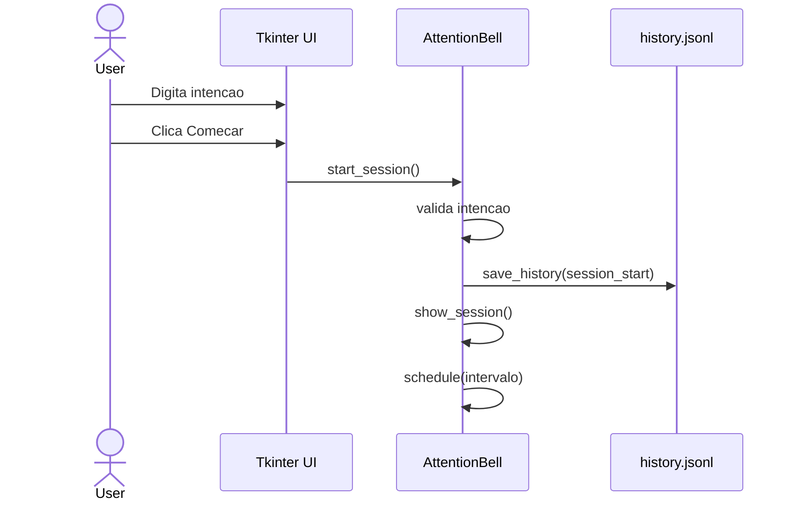
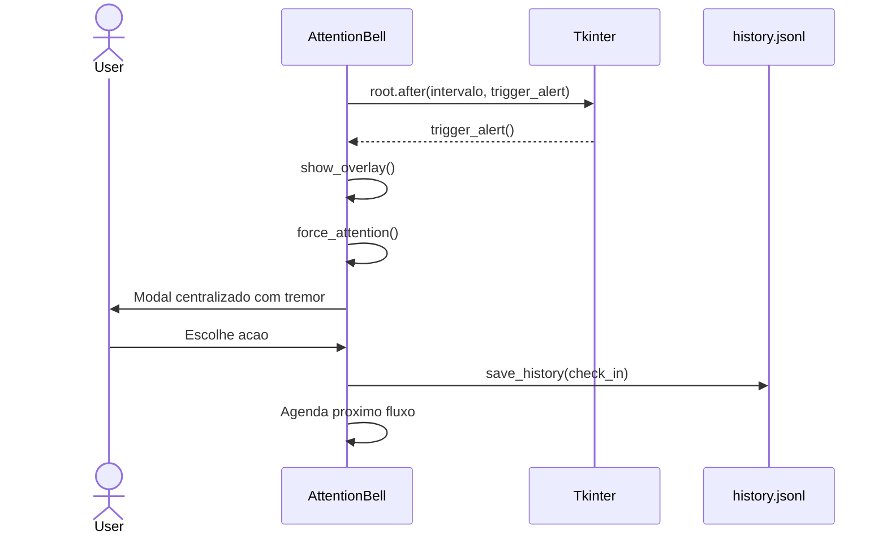
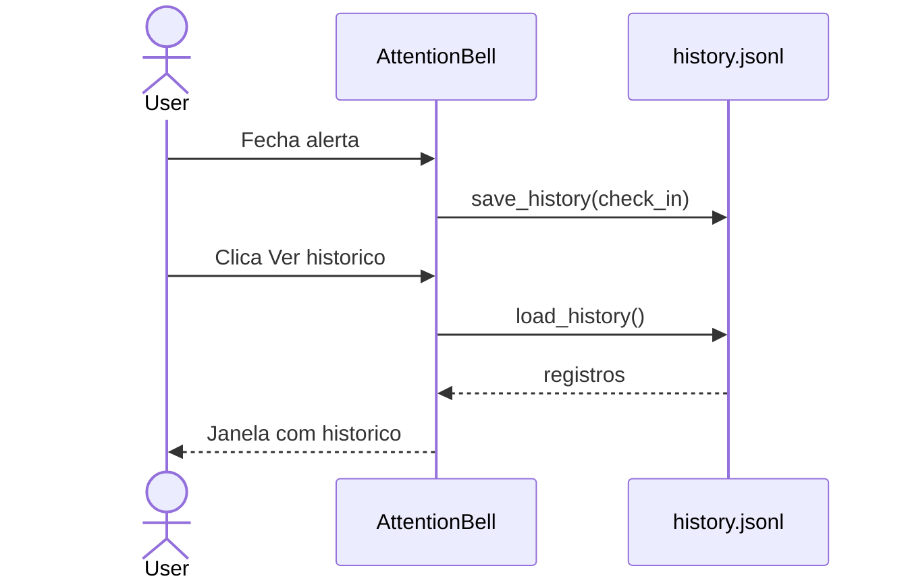
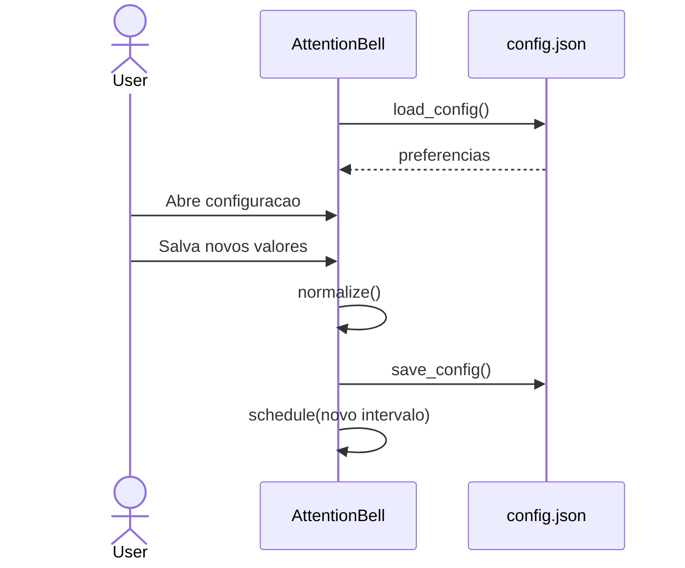

# System Feature Flows

> Registro historico e incremental dos fluxos internos de cada funcionalidade.
> Este documento cresce a cada nova feature implementada e nao deve ter secoes removidas sem registro de decisao.

---

## Indice

- [Visao Geral da Arquitetura](#visao-geral-da-arquitetura)
- [Convencoes deste Documento](#convencoes-deste-documento)
- [Feature: Sessao de Intencao](#feature-sessao-de-intencao)
- [Feature: Timer e Alerta de Atencao](#feature-timer-e-alerta-de-atencao)
- [Feature: Historico Local](#feature-historico-local)
- [Feature: Configuracao Local](#feature-configuracao-local)

---

## Visao Geral da Arquitetura

**Padrao arquitetural:** aplicacao desktop monolitica orientada a eventos.

**Fluxo global de interacao:**

```text
Usuario
    -> Tkinter widgets
        -> Metodos de AttentionBell
            -> Estado em memoria
            -> root.after() para timers
            -> Arquivos locais quando ha persistencia
```

**Camadas e responsabilidades:**

| Camada | Responsabilidade |
|--------|------------------|
| Interface Tkinter | Entradas do usuario, janelas, botoes, overlay e modais |
| Orquestracao | Classe `AttentionBell`, estado da sessao e controle de timers |
| Persistencia local | Funcoes `load_config`, `save_config`, `load_history` e `save_history` |
| Sistema operacional | Gerenciador de janelas, bell do sistema e politica de foco |

---

## Convencoes deste Documento

- Nao ha API HTTP, autenticacao, banco de dados ou integracoes externas.
- Persistencia e feita apenas em arquivos locais no diretorio do projeto.
- Timers devem usar `root.after()` para evitar bloqueio da interface.
- Respostas e intencoes podem conter texto pessoal e devem permanecer locais.

---

# Feature: Sessao de Intencao

> **Versao:** 1.0.0
> **Implementada em:** 2026-05-15
> **Status:** Concluida

---

## Resumo

Esta feature cria o ritual inicial do app: antes de qualquer timer, o usuario declara uma intencao curta para a sessao. A intencao fica em memoria enquanto a sessao esta ativa e e usada nos alertas periodicos.

**Motivacao:** Sem uma intencao explicita, o alerta seria generico e menos util.
**Resultado:** O app abre direto na tela de intencao e so inicia o timer depois de uma entrada valida.

---

## Fluxo Principal

### 1. Ponto de Entrada

- **Tipo:** Interface desktop Tkinter
- **Arquivo:** `main.py`
- **Evento:** abertura do app e clique em `Comecar`
- **Autenticacao:** nenhuma

Ao iniciar, `AttentionBell.__init__` cria a janela principal e chama `show_start()`.

### 2. Validacao de Entrada

- **Arquivo:** `main.py`
- **Biblioteca:** Tkinter e validacao manual com `strip()`

| Campo | Tipo | Obrigatorio | Regra de validacao |
|-------|------|-------------|--------------------|
| Intencao | string | Sim | Nao pode ficar vazia apos `strip()` |

**Falha de validacao:** exibe `messagebox.showinfo` e nao inicia sessao.

### 3. Orquestracao da Aplicacao

- **Arquivo:** `main.py`
- **Metodo:** `start_session`

1. Le o texto do campo de intencao.
2. Valida que ha conteudo.
3. Atualiza `current_intention`.
4. Marca a sessao como ativa.
5. Registra `session_start` no historico local.
6. Renderiza a tela de sessao.
7. Agenda o timer principal.

### 4. Regras de Negocio

| Regra | Descricao | Localizacao no Codigo |
|-------|-----------|-----------------------|
| Intencao obrigatoria | O timer nao deve iniciar sem intencao declarada. | `start_session` |
| Intencao atual em memoria | A intencao ativa fica em `current_intention`. | `AttentionBell` |
| Fechar minimiza | O botao `X` minimiza em vez de encerrar o app. | `root.protocol("WM_DELETE_WINDOW", root.iconify)` |

### 5. Persistencia / Integracoes

| Repositorio | Operacao | Arquivo |
|-------------|----------|---------|
| Historico local | Grava evento `session_start` | `history.jsonl` |

**Integracoes externas:** nenhuma.

### 6. Resposta Final

Nao ha resposta HTTP. Em sucesso, a tela muda para `Sessao em andamento` e o timer e agendado.

---

## Fluxos Alternativos e Erros

| Cenario | Comportamento |
|---------|---------------|
| Intencao vazia | Exibe aviso e permanece na tela inicial |
| Usuario clica no X | Janela minimiza e processo continua ativo |

---

## Diagrama de Sequencia



---

## Decisoes Tecnicas

### ADR-001 — Tkinter puro no MVP

| Campo | Detalhe |
|-------|---------|
| **Status** | Aceita |
| **Data** | 2026-05-15 |
| **Contexto** | O app deve ser leve, local, multiplataforma e simples de rodar. |
| **Decisao** | Usar Tkinter puro e evitar bandeja do sistema na primeira versao. |
| **Consequencias** | Menos dependencias e setup mais simples; menos integracao nativa com tray. |

---

# Feature: Timer e Alerta de Atencao

> **Versao:** 1.0.0
> **Implementada em:** 2026-05-15
> **Status:** Concluida

---

## Resumo

Esta feature agenda lembretes periodicos sem bloquear a interface. Quando o timer dispara, o app pode mostrar um overlay vermelho suave e depois abrir um modal centralizado que tenta interromper o usuario.

**Motivacao:** O app precisa funcionar como um sino de atencao, nao como monitor de produtividade.
**Resultado:** O usuario recebe uma interrupcao visual direta para revisar sua intencao.

---

## Fluxo Principal

### 1. Ponto de Entrada

- **Tipo:** Timer Tkinter
- **Arquivo:** `main.py`
- **Evento:** callback de `root.after()`
- **Autenticacao:** nenhuma

O fluxo inicia quando `schedule()` agenda `trigger_alert()` usando o intervalo configurado.

### 2. Validacao de Entrada

| Campo | Tipo | Obrigatorio | Regra de validacao |
|-------|------|-------------|--------------------|
| `timer_interval_minutes` | inteiro | Sim | Minimo 1 |
| `snooze_interval_minutes` | inteiro | Sim | Minimo 1 |
| `overlay_enabled` | booleano | Sim | Convertido para bool |
| `overlay_opacity` | float | Sim | Limitado entre 0.01 e 0.35 |

**Falha de validacao:** `normalize()` aplica valores padrao.

### 3. Orquestracao da Aplicacao

- **Arquivo:** `main.py`
- **Metodos:** `schedule`, `trigger_alert`, `show_overlay`, `show_alert`, `close_alert`

1. `schedule()` cancela timer anterior e agenda novo callback.
2. `trigger_alert()` verifica se a sessao esta ativa e nao pausada.
3. Se o overlay estiver habilitado, `show_overlay()` exibe pulsacoes vermelhas.
4. `show_alert()` tenta desminimizar, trazer foco, tocar bell e abrir modal.
5. O modal treme brevemente no centro da tela.
6. O usuario escolhe continuar, adiar, ajustar intencao ou encerrar sessao.

### 4. Regras de Negocio

| Regra | Descricao | Localizacao no Codigo |
|-------|-----------|-----------------------|
| Timer nao-bloqueante | Agendamento deve usar `root.after()`. | `schedule` |
| Retomar reinicia intervalo | Ao sair da pausa, o intervalo principal comeca inteiro. | `toggle_pause` |
| Pausa nao entra no historico | Pausar e retomar nao registram eventos. | `toggle_pause` |
| Adiar usa intervalo curto | `Adiar` agenda `snooze_interval_minutes`. | `close_alert` |
| Alerta deve interromper | O app tenta desminimizar, ganhar foco, tocar bell e tremer. | `force_attention`, `shake` |

### 5. Persistencia / Integracoes

| Repositorio | Operacao | Arquivo |
|-------------|----------|---------|
| Historico local | Grava `check_in` ao fechar alerta | `history.jsonl` |
| Historico local | Grava `snoozed` ao adiar | `history.jsonl` |

**Integracoes externas:** nenhuma. O foco depende da politica do gerenciador de janelas do sistema operacional.

### 6. Resposta Final

Nao ha resposta HTTP. Em sucesso, o alerta fecha e o proximo timer e agendado ou a sessao muda de estado.

---

## Fluxos Alternativos e Erros

| Cenario | Comportamento |
|---------|---------------|
| Sessao pausada | Timer nao dispara alerta |
| Overlay desabilitado | Modal abre direto |
| Gerenciador bloqueia foco | App ainda cria modal always-on-top, mas foco absoluto pode falhar |
| Usuario pressiona Escape | Equivale a `Continuar` |

---

## Diagrama de Sequencia



---

## Decisoes Tecnicas

### ADR-002 — Alerta forte sem monitoramento

| Campo | Detalhe |
|-------|---------|
| **Status** | Aceita |
| **Data** | 2026-05-15 |
| **Contexto** | O usuario quer uma interrupcao clara, mas o app nao deve vigiar atividade. |
| **Decisao** | Usar foco Tkinter, always-on-top, bell e tremor curto; nao capturar tela nem janelas. |
| **Consequencias** | Mantem privacidade, mas foco absoluto pode variar por sistema operacional. |

---

# Feature: Historico Local

> **Versao:** 1.0.0
> **Implementada em:** 2026-05-15
> **Status:** Concluida

---

## Resumo

Esta feature salva localmente eventos da sessao para que o usuario veja progresso e padroes. O historico e exibido pela interface em ordem mais recente primeiro e pode ser limpo manualmente.

**Motivacao:** O usuario decidiu que respostas e check-ins devem gerar perspectiva de progresso.
**Resultado:** O app persiste eventos em `history.jsonl` sem internet e sem banco remoto.

---

## Fluxo Principal

### 1. Ponto de Entrada

- **Tipo:** Eventos internos da aplicacao
- **Arquivo:** `main.py`
- **Eventos:** inicio, check-in, adiamento, ajuste e encerramento
- **Autenticacao:** nenhuma

### 2. Validacao de Entrada

| Campo | Tipo | Obrigatorio | Regra de validacao |
|-------|------|-------------|--------------------|
| `intention` | string | Sim | Pode ser texto livre da sessao |
| `response` | objeto ou string legada | Nao | Novo formato usa tres campos; registros antigos podem ter texto simples |
| `event_type` | string | Sim | Valor definido pelo codigo |
| `previous_intention` | string | Nao | Usado em ajuste de intencao |

**Falha de validacao:** linhas JSON invalidas sao ignoradas na leitura por `load_history()`.

### 3. Orquestracao da Aplicacao

- **Arquivo:** `main.py`
- **Metodos:** `save_history`, `load_history`, `show_history`

1. Eventos chamam `save_history()`.
2. A funcao adiciona `created_at` com data/hora local.
3. O registro e escrito como uma linha JSON em `history.jsonl`.
4. `show_history()` le o arquivo, ignora linhas invalidas e mostra registros em ordem reversa.
5. `Limpar historico` remove `history.jsonl`.

### 4. Regras de Negocio

| Regra | Descricao | Localizacao no Codigo |
|-------|-----------|-----------------------|
| Tres respostas independentes | Cada pergunta do alerta tem sua propria caixa de texto. | `show_alert`, `close_alert` |
| Salvar check-in vazio | Alertas sem resposta tambem entram no historico. | `close_alert` |
| Mais recentes primeiro | Visualizacao usa `reversed(records)`. | `show_history` |
| Pausas nao registradas | Pausa/retomada nao devem poluir o historico. | `toggle_pause` |
| Limpeza local | Usuario pode apagar todo o historico pela interface. | `show_history` |

### 5. Persistencia / Integracoes

| Repositorio | Operacao | Arquivo |
|-------------|----------|---------|
| Historico local | Append JSON Lines | `history.jsonl` |
| Historico local | Leitura completa | `history.jsonl` |
| Historico local | Exclusao | `history.jsonl` |

**Integracoes externas:** nenhuma.

### 6. Resposta Final

Nao ha resposta HTTP. Em sucesso, o historico aparece em uma janela Tkinter com registros legiveis.

---

## Fluxos Alternativos e Erros

| Cenario | Comportamento |
|---------|---------------|
| Arquivo inexistente | Mostra `Nenhum registro ainda.` |
| Linha JSON invalida | Linha e ignorada |
| Usuario cancela limpeza | Arquivo permanece intacto |

---

## Diagrama de Sequencia



---

## Decisoes Tecnicas

### ADR-003 — JSON Lines para historico

| Campo | Detalhe |
|-------|---------|
| **Status** | Aceita |
| **Data** | 2026-05-15 |
| **Contexto** | O historico precisa ser local, simples e legivel sem banco de dados. |
| **Decisao** | Usar `history.jsonl`, com um evento por linha. |
| **Consequencias** | Append simples e facil de inspecionar; consultas complexas exigiriam evolucao futura. |

---

# Feature: Configuracao Local

> **Versao:** 1.0.0
> **Implementada em:** 2026-05-15
> **Status:** Concluida

---

## Resumo

Esta feature permite configurar intervalos e comportamento visual sem alterar codigo. A configuracao fica em `config.json` e tambem pode ser alterada pela interface.

**Motivacao:** O usuario precisa ajustar o ritmo dos alertas e poder desativar o overlay por conforto visual.
**Resultado:** O app carrega, normaliza e salva preferencias locais.

---

## Fluxo Principal

### 1. Ponto de Entrada

- **Tipo:** Leitura de arquivo local e janela de configuracao
- **Arquivo:** `main.py`
- **Evento:** inicializacao do app ou clique em `Configurar intervalo`
- **Autenticacao:** nenhuma

### 2. Validacao de Entrada

| Campo | Tipo | Obrigatorio | Regra de validacao |
|-------|------|-------------|--------------------|
| `timer_interval_minutes` | inteiro | Sim | Minimo 1 |
| `snooze_interval_minutes` | inteiro | Sim | Minimo 1 |
| `overlay_enabled` | booleano | Sim | Convertido para bool |
| `overlay_color` | string | Sim | Fallback `#FF0000` |
| `overlay_opacity` | float | Sim | Entre 0.01 e 0.35 |
| `overlay_pulses` | inteiro | Sim | Minimo 1 |

**Falha de validacao:** valores padrao sao aplicados por `normalize()`.

### 3. Orquestracao da Aplicacao

- **Arquivo:** `main.py`
- **Metodos:** `load_config`, `save_config`, `normalize`, `open_settings`

1. App inicia e chama `load_config()`.
2. Se `config.json` nao existir, cria com `DEFAULT_CONFIG`.
3. Se existir, carrega JSON e normaliza valores.
4. A janela de configuracao permite mudar intervalo, adiamento e overlay.
5. Ao salvar, `save_config()` persiste o arquivo e reagenda timer ativo.

### 4. Regras de Negocio

| Regra | Descricao | Localizacao no Codigo |
|-------|-----------|-----------------------|
| Minutos inteiros | Intervalos sao convertidos para `int`. | `normalize` |
| Overlay opcional | Usuario pode desativar overlay. | `open_settings` |
| Intencao nao entra em config | `config.json` guarda apenas preferencias gerais. | `DEFAULT_CONFIG` |

### 5. Persistencia / Integracoes

| Repositorio | Operacao | Arquivo |
|-------------|----------|---------|
| Configuracao local | Leitura JSON | `config.json` |
| Configuracao local | Escrita JSON | `config.json` |

**Integracoes externas:** nenhuma.

### 6. Resposta Final

Nao ha resposta HTTP. Em sucesso, preferencias sao salvas e o timer ativo e reagendado com o novo intervalo.

---

## Fluxos Alternativos e Erros

| Cenario | Comportamento |
|---------|---------------|
| `config.json` inexistente | Arquivo e criado com defaults |
| JSON invalido | App usa defaults e exibe aviso |
| Valores invalidos | `normalize()` aplica fallback |

---

## Diagrama de Sequencia


